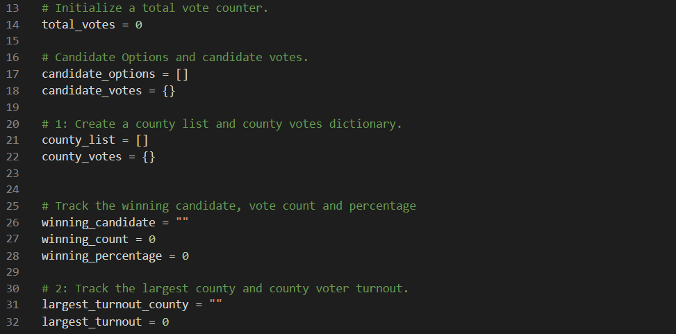
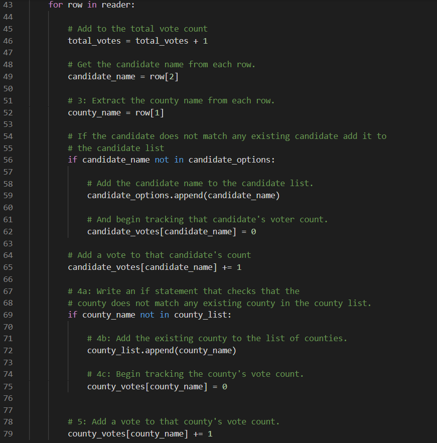

# Election_Analysis

## Project Overview
At the request of an employee at the Colorado Board of Elections, I have been given the following tasks to complete the election audit of a local recent election.

1. Calculate the total number of votes cast
2. Get a complete list of candidates and counties which took place in this election
3. Calculate the total number of votes and percentage of votes contributed by each county
4. Calculate the total number and percentage of votes each candidate recieved
5. Determine the winner based on popular vote and largest contributing county overall

## Resources
Data Source: election_results.csv
Software: Python 3.7.6, Visual Studio Code 1.54.3

## Summary
The analysis of the election show that:

* There were 369,711 votes cast in this election
* The candidates of this election were:
  * Charles Casper Stockham
  * Diana DeGette
  * Raymon Anthony Doane
* The counties in which this election took place:
  * Jefferson
  * Denver
  * Arapahoe
* The counties contribution to this election were:
  * Jefferson had 10.5% of the votes, with 38,855 votes in total from this county.
  * Denver had 82.8% of the votes, with 306,055 votes in total from this county.
  * Arapahoe 6.7% of the votes, with 24,801 votes in total from this county.
* The candidate results of this election were:
  * Charles Casper Stockham recieved 23.0% of the votes, with 85,213 votes in total.
  * Diana DeGette recieved 73.8% of the votes, with 272,892 votes in total.
  * Raymon Anthony Doane recieved 3.1% of the votes, with 11,606 votes in total.

## Results

* The winner of this election was:
  * Diana DeGette recieved 73.8% of the votes, with 272,892 votes in total
* The largest contributing county for this election was:
  * Denver, with 82.8% of the votes overall, a total of 272,892 votes from this county.

## Review of Audit
The script used to conduct this audit, with some modifications, can be applied to any election.

By expanding this list of variables, we can capture more data from the voters, from their status to their gender. From there, we can reuse out implemented loops to count whichever added statistic for any analysis.

Additionally, to apply the script to other situations, changing our aformentioned variables to have more generic names allows for easier understanding and integration, should another person be adjusting the script for their own data analysis on another type of election.
